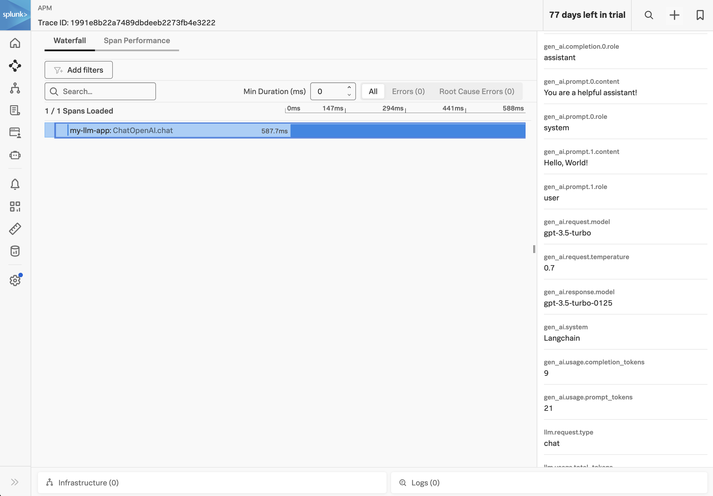

# v2:  LangChain with GPT 3.5 Turbo

This version of the application use the LangChain framework, which provides many features and benefits that we'll use in 
later iterations of the application. 

## Prerequisites

* Python 3.9+
* [Splunk Distribution of the OpenTelemetry Collector](https://docs.splunk.com/observability/en/gdi/opentelemetry/opentelemetry.html#otel-intro-install) 

## Run the Application

Execute the following commands to run the application: 

````
# clone the repo if you haven't already
git clone https://github.com/dmitchsplunk/langchain-with-splunk.git

# navigate to the directory repo
cd langchain-with-splunk/v2

# create a virtual environment 
python3 -m venv openai-env

# activate the virtual environment
source openai-env/bin/activate

# install the required packages
pip3 install -r ./requirements.txt

# define the service name and environment
export OTEL_SERVICE_NAME=my-llm-app
export OTEL_RESOURCE_ATTRIBUTES='deployment.environment=test'

# run the application
splunk-py-trace flask run -p 8080
````

## Test the Application

We can use the existing question.json file with the following content: 

````
{
  "question":"Hello, World!"
}
````

Then open a second terminal window to exercise the application using the following curl command.

````
curl -d "@question.json"  -H "Content-Type: application/json" -X POST http://localhost:8080/askquestion
````

It will respond with something like:

````
Hello! How can I assist you today?
````

You should see a trace in Splunk Observability Cloud such as the following: 

